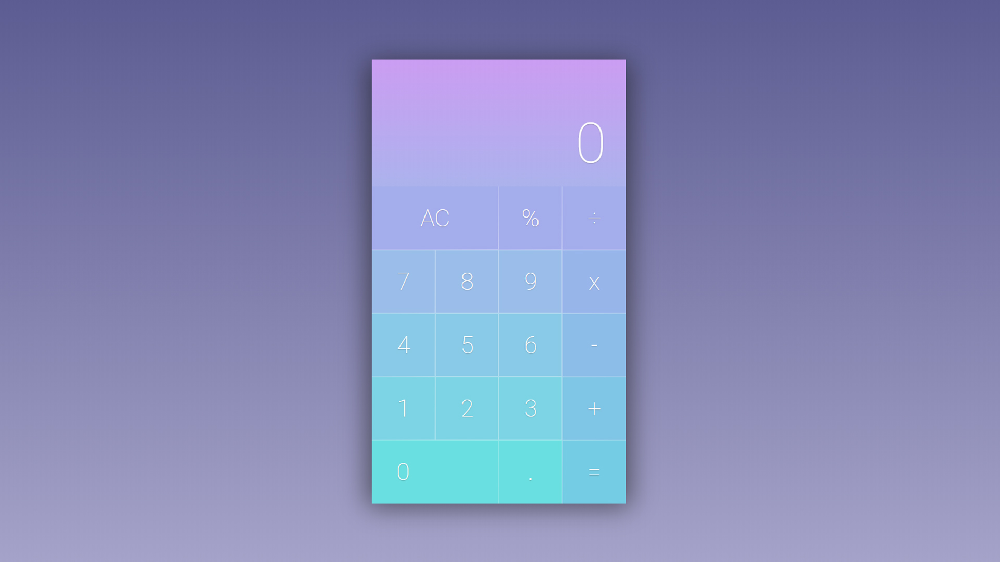

# JavaScript exercise 1 - Calculator
> My first practical project while learning JavaScript. [Click here to preview](https://karbudzik.github.io/JavaScript-exercise-1-browser-calculator/)

## Screenshots

## Technologies
* HTML5.2
* plain CSS / no frameworks
* plain JavaScript / no frameworks

## Credits
* [girlsjs.pl](https://girlsjs.pl) - the script was based on the materials provided by the organizers of girls.js workshops
* [behance.net](https://www.behance.net/gallery/50151749/Daily-UI-004-Calculator) - the interface of the calculator was aimed to recreate the design of UX designer Jenny Hua found on behance.net
